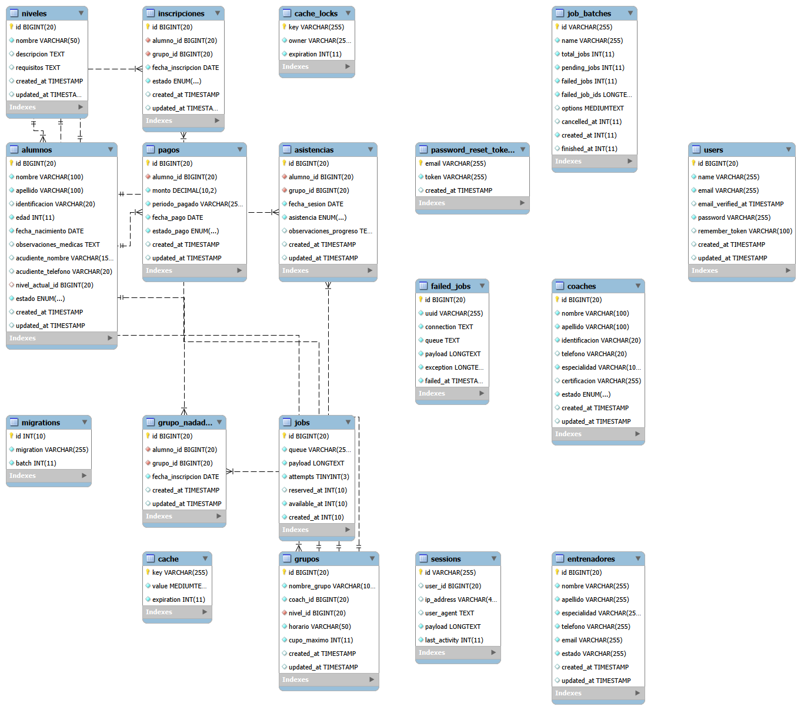

# AquaKids Swimming

Sistema de gestión académica para la academia de natación "AquaKids". Esta plataforma permite administrar nadadores, entrenadores, niveles, grupos, asistencias y pagos, optimizando el control operativo en el complejo acuático.

## 📋 Descripción del Proyecto
AquaKids Swimming surge para solucionar las dificultades de registro manual y seguimiento del progreso de los nadadores. El sistema centraliza la información bajo una arquitectura MVC, garantizando integridad de datos y facilidad de consulta.

## 🚀 Módulos del Sistema
- **Acceso:** Autenticación segura de usuarios.
- **Gestión de Usuarios:** Control de roles y accesos.
- **Gestión de Nadadores:** Registro de datos personales y médicos.
- **Gestión de Entrenadores:** Registro de especialidades y estados.
- **Niveles y Grupos:** Configuración de capacidades y horarios.
- **Inscripciones:** Gestión de relaciones entre nadadores y grupos.
- **Asistencia y Progreso:** Registro diario y seguimiento de niveles.
- **Pagos y Reportes:** Control financiero y reportes de gestión.

## 🛠 Herramientas y Tecnologías
- **Framework:** Laravel (PHP)
- **Base de Datos:** MySQL (XAMPP)
- **Lenguajes:** PHP, HTML5, CSS3, JavaScript
- **Arquitectura:** MVC (Modelo-Vista-Controlador)
- **Control de Versiones:** Git / GitHub

## 📂 Estructura del Proyecto (MVC)
```text
AquaKids/
├── app/          # Lógica de negocio (Modelos y Controladores)
├── config/       # Archivos de configuración
├── database/     # Migraciones y scripts SQL
├── public/       # Archivos públicos (CSS, JS, Imágenes)
├── resources/    # Vistas (Blade templates)
├── routes/       # Definición de rutas web
└── storage/      # Logs y archivos del sistema

## 
Para ejecutar este proyecto en tu entorno local, sigue estos pasos:

Clonar el repositorio:
Abre tu terminal y ejecuta:

Bash
git clone https://github.com/carlossayagober/AquaKids.git
cd AquaKids

## 2. **Instalar dependencias de PHP:**
   Es necesario tener [Composer](https://getcomposer.org/) instalado. Ejecuta en la raíz del proyecto:
   ```bash
   composer install

## 3 Configurar el entorno:

Crea un archivo .env a partir del ejemplo:
cp .env.example .env

Abre el archivo .env y configura los datos de acceso a tu base de datos MySQL (DB_DATABASE, DB_USERNAME, DB_PASSWORD).
Generar clave de aplicación:

php artisan key:generate


## 4 Preparar la Base de Datos:
   - Importa el archivo `database/aquakids_db.sql` (disponible en la carpeta del proyecto) a través de tu gestor de base de datos (MySQL Workbench).
   - Ejecuta las migraciones para asegurar las tablas:
     ```bash
php artisan migrate
Iniciar el servidor:

php artisan serve

   *El sistema estará disponible en `[http://127.0.0.1:8000](http://127.0.0.1:8000)`.*


## 📊 Modelo Entidad-Relación (MER)



Carlos Sayago
Aprendiz - Desarrollo de Software


